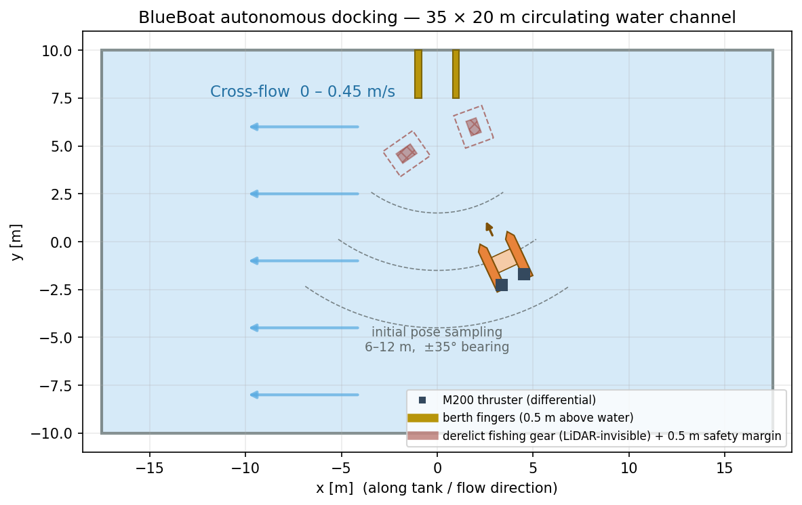
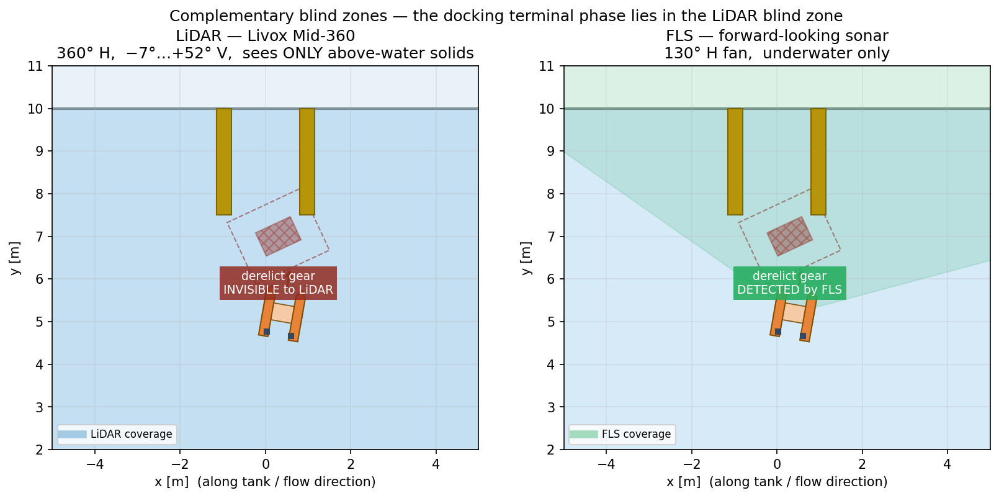

# usvdock — BlueBoat 수상 자율 도킹 (Isaac Sim / Isaac Lab)

무인수상정(BlueBoat)이 **수상 LiDAR + 수중 FLS**를 함께 써서 안벽 선석에 접안하는
강화학습 연구. 접근 경로에 **폐어구(유령어구)** 가 떠 있고, 이는 LiDAR에 원리적으로
보이지 않으며 프로펠러에 감기면 선박이 무력화된다.



---

## 핵심 논지 — 두 센서의 사각이 물리적으로 상보적이다

| | 보는 것 | 못 보는 이유 |
|---|---|---|
| **LiDAR** (Livox Mid-360) | 수면 **위** 고체만 | 수면 아래 — 스침각 정반사 + 905 nm 흡수 |
| **FLS** (130°×20°) | 수면 **아래**만 | 음향이라 물이 **전달 매질** |

"센서를 하나 더 붙이니 좋아졌다"가 아니라 **위험이 정확히 LiDAR의 사각에 놓인다**는 것이 논지다.



---

## 실험 구조

```
1단계 (쉬운 환경, 폐어구 없음)      PID(LiDAR)      vs  RL(LiDAR)
2단계 (어려운 환경, 경로상 폐어구)   PID(LiDAR+FLS)  vs  RL(LiDAR+FLS)
      + 절제                        RL(LiDAR only)  → 폐어구를 못 보고 돌진
```

Task ID: `Isaac-USVDock-M{1,2}-{Lidar,Fusion}-v0`

공정성 장치:
- 모든 방식이 **같은 seed** 로 완전히 동일한 에피소드를 푼다
- PID 도 RL 과 **같은 검출기**(`perception.detect_berth`)를 쓴다. 정답 좌표를 쓰지 않는다
- PID 의 회피도 **현재 스캔에 즉시 반응**한다. 전역 경로계획을 주면 PID 쪽에만
  지도와 계획이 생겨 비교가 교란된다

---

## 설치

```bash
git clone <this-repo> ~/usvdock && cd ~/usvdock
bash scripts/setup.sh          # 자산 내려받기 + 이미지 3단 빌드 + 검증
```

**요구사항**: NVIDIA 드라이버 **580 이상**(Isaac Sim 5.1 요구), Docker + nvidia-container-toolkit,
디스크 60 GB 이상.

### 이미지 체인

```
nvcr.io/nvidia/isaac-sim:5.1.0
  └ isaac-lab-base           IsaacLab 포크의 docker/ 구성
      └ isaac-lab-base-fixed ← 누락된 isaaclab 코어 복구
          └ usvdock
```

> **왜 `-fixed` 가 필요한가**
> `isaac-lab-base` 를 그냥 빌드하면 **반쪽짜리로 나온다.** `isaaclab==0.54.0` 의 의존성
> `flatdict==4.0.1` 이 sdist 이고 구식 `setup.py` 를 쓰는데, pip 이 격리 빌드환경에 받는
> 최신 setuptools 에는 `pkg_resources` 가 없어 실패한다. `isaaclab.sh --install` 은 실패
> 모듈을 건너뛰므로 **`docker build` 는 exit 0** 이고, 핵심 `isaaclab` 만 빠진 이미지가
> 나온다(나머지 5개 확장은 정상). `docker/Dockerfile.isaaclab-fix` 가 그 복구 레이어이며,
> 마지막에 `import isaaclab` 검증을 넣어 같은 실패가 조용히 재발하지 않게 했다.

`usvdock` 은 `marinelab`/`constrained-albc` 를 **import 하지 않는다**. 자체 3자유도
Fossen 모델을 쓰므로 그쪽 저장소가 없어도 동작한다.

---

## 실행

```bash
# 단위시험 (Isaac Sim 불필요)
python3 scripts/test_geometry.py
python3 -m usvdock.dynamics          # 최대속력 3.000 m/s 재현 검증

# 학습
bash scripts/run_train.sh C_M2 Isaac-USVDock-M2-Fusion-v0 3000 2048
bash scripts/run_all.sh              # 4회 순차 (약 2시간 15분)

# 평가
python3 scripts/eval.py --stage 2 --checkpoint_rl <...> --checkpoint_ablation <...>
python3 scripts/clearance_curve.py --run_dir logs/.../C_M2_xxx --task <...>

# 궤적 기록 + 4컷 영상
python3 scripts/rollout.py --task <...> --checkpoint <...> --scene 0 --out traj/a.npz
python3 scripts/make_video.py traj/a.npz traj/b.npz traj/c.npz traj/d.npz --out out.gif

# 그림 (버전 폴더에 저장, figures/latest 링크 갱신)
python3 scripts/make_figures.py --tag v2_gear
```

---

## 반드시 지킬 것

1. **`PYTHONUNBUFFERED=1`** — 선택이 아니다. Isaac Sim 의 `simulation_app.close()` 가
   파이썬 stdout 버퍼를 비우지 않고 종료해 **print 출력이 통째로 사라진다.**
   (`run_train.sh` 는 이미 설정한다)

2. **컨테이너에 `--name` 을 붙이고 `docker kill` 로 정리** — `timeout` 은 docker
   **클라이언트**만 죽이고 컨테이너는 계속 돈다. 잔여 컨테이너 2개가 GPU 를 나눠 써서
   학습이 30배 느려진 적이 있다.

3. **학습 로그·그림을 덮어쓰지 말 것** — 파일명에 타임스탬프/태그를 붙인다.
   시나리오가 바뀌면 이전 결과와 비교해야 한다.

4. **`pip install` 시 constraints 를 걸 것**
   ```
   PIP_CONSTRAINT=/tmp/isaaclab-core.constraints.txt /isaac-sim/python.sh -m pip install ...
   ```
   없으면 `cmeel-boost` 서브트리 백트래킹으로 사실상 끝나지 않는다.

---

## 구조

```
usvdock/
  blueboat_cfg.py    물리 파라미터. 값마다 출처 표기 [SPEC]/[SDF]/[CAL]/[EST]
  dynamics.py        3자유도 Fossen 조종 모델 (최대속력으로 보정)
  geometry.py        해석적 레이캐스팅 (AABB + OBB), 충돌·이격거리
  perception.py      LiDAR 버스 검출 — 세 방식이 공유하는 인지 프론트엔드
  envs/              DirectRLEnv + PPO 설정 + gym 등록
  controllers/pid.py 고전 파이프라인 (검출 → 시선각 유도 → PID + FLS 회피)
scripts/             setup / train / eval / rollout / figures / video
docker/              Dockerfile 2종 + pip constraints
```

### 모델링 결정 (발표 질의응답 대비)

- **동역학**: PhysX 에 외력을 가하는 대신 3자유도 Fossen 을 torch 로 적분하고 자세를
  기록(kinematic). 정적 수조 도킹에서 heave/roll/pitch 는 관심 대상이 아니고,
  자유표면 부력 튜닝은 위험만 크다. 모델은 **제조사 공식 최대속력 3.0 m/s 를 재현**하도록
  보정하고 단위시험으로 확인했다.
- **센싱**: Isaac Lab RayCaster 대신 해석적 교차 계산. 장면이 전부 박스라 정확하고,
  **어떤 센서가 무엇을 보는지 정확히 통제**할 수 있다.
- **수면을 LiDAR 대상에서 제외**했다. 넣어두면 광선이 수면에 맞아 실제 Mid-360 이 결코
  주지 않는 신호를 정책이 공짜로 얻고, 실기에서 그대로 무너진다.
- **인지는 거의 단일 프레임**이다. SLAM·점유격자·전역 지도·자기위치추정을 하지 않는다.
  예외 하나: 선석 추정을 **추측항법으로 유지**한다. 배가 선석 옆에 붙으면 가까운 핑거가
  먼 핑거를 가려 검출이 무너지기 때문이다(실측: 벽 2 m 안쪽 + 횡오프셋 1 m 에서 실패).
  단, 시뮬레이터의 정확한 변위를 쓰면 공짜 점심이므로 **DVL 수준 잡음(2 %)** 을 섞었다.
  외부 입력은 **선수각과 자기 속도** 뿐이며 IMU/DVL 로 관측 가능한 양이다.
  한계: 정책 자체는 MLP 라 기억이 없다 (향후: 순환 정책 또는 국소 점유격자).
- **폐어구는 등가 음향 표적**으로 모델링했다. 단섬유 그물의 표적강도는 실제로 매우 낮고,
  탐지는 뜸줄·발줄·부착생물의 반사에 의존한다 — 지금도 연구 중인 문제다.

---

## 자산 출처

- BlueBoat 메시·SDF: [ArduPilot/SITL_Models](https://github.com/ArduPilot/SITL_Models)
  (원 CAD: Blue Robotics). 저장소에 커밋하지 않고 `scripts/fetch_assets.sh` 로 받는다.
- 제원: [Blue Robotics BlueBoat](https://bluerobotics.com/store/boat/blueboat/blueboat/),
  [Livox Mid-360](https://www.livoxtech.com/mid-360/specs)

## 관련 기록

- `작업기록.txt` — 세션별 누적 작업 기록. 이어할 때 여기부터 읽을 것
- `발표메모.md` — 발표용 논점 정리 (정정 이력 포함)
